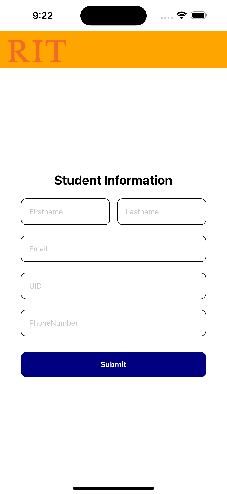
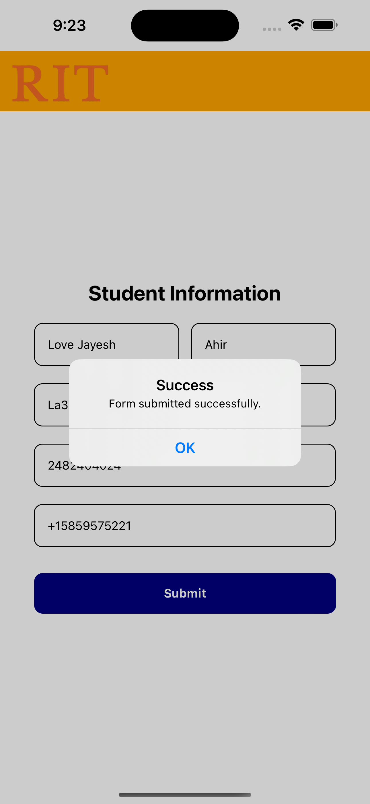
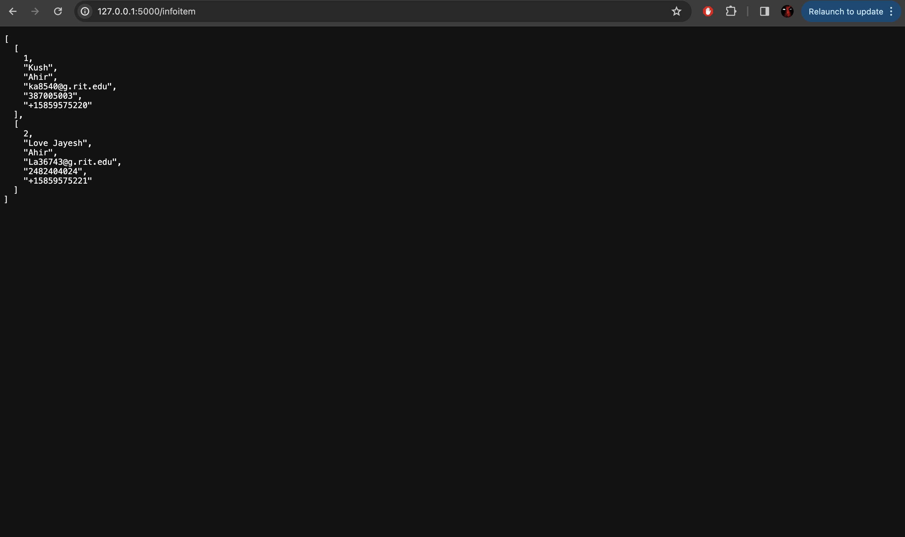

# Student Information Management System

## Introduction

This project provides a full solution for managing student information by combining a React Native front-end application with a Flask-powered RESTful API backend and a PostgreSQL database. It enables the submission, retrieval, updating, and deletion of student records, ensuring a consistent user experience across all mobile devices.

## Project Structure

The system is divided into three main components:

1. React Native Application: A cross-platform mobile application for data input and display.
2. Flask API: Serves as the middleman between the front-end application and the database, handling HTTP requests.
3. PostgreSQL Database: Stores student information securely and efficiently.

## Getting Started

### Prerequisites

1. Node.js and npm (for React Native app)
2. Python 3.x (for Flask API)
3. PostgreSQL (for the database)

### Setup Instructions

Frontend (React Native App)

1. Install dependencies: npm install
2. Start the application: npm start

Backend (Flask API)

1. Create a virtual environment and activate it:

python3 -m venv venv
source venv/bin/activate # Use `venv\Scripts\activate` on Windows

2. Install required Python packages: pip install flask flask-restful flask-cors psycopg2-binary

3. Initialize the database with infoDetail.sql script.

4. Run the Flask server: python server.py

Database

Set up a PostgreSQL database and apply the schema from infoDetail.sql.

## API Reference

1. POST /infoitem: Submit new student information.
2. GET /infoitem: Retrieve all student records.
3. PUT /infoitem/<id>: Update a specific student record.
4. DELETE /infoitem/<id>: Delete a specific student record.

## Features

Submit and validate student information through a user-friendly mobile interface.
View all student records stored in the database.
Update or delete existing student information.

## Future Work

Enhance the security of the application by implementing authentication and authorization mechanisms.
Introduce more interactive elements in the UI for a better user experience.
Expand the database schema to include more details about students.

## Contributing

Contributions to this project are welcome. Please fork the repository and submit a pull request with your improvements.

## Screenshots

;

## Application of the Visitor Pattern in My Project

The Visitor pattern is an important design choice in our project since it increases the flexibility and scalability of actions performed on objects without modifying their classes. The following sections describe how we implemented the Visitor pattern in our application, with an emphasis on the InfoItem class and its interactions with various visitors.

### Structure and Implementation

1. InfoItem (Element): My InfoItem class acts as the Element in the Visitor pattern framework. It represents individual entries or objects that contain user information such as name, email, and mobile number. To accommodate different operations, each InfoItem object has an accept method that takes a visitor object as an argument and calls the appropriate method on the visitor based on the InfoItem instance.

2. InfoItemVisitor (Visitor Interface): The InfoItemVisitor abstract class serves as the foundation for any operation (visitor) I want to perform on InfoItem objects. It declares the visit_info_item method, which concrete visitors will implement according to their specific operation's logic.

3. InfoItemValidator (Concrete Visitor): A concrete implementation of the InfoItemVisitor, the InfoItemValidator class, is designed to validate the data contained within InfoItem instances. It overrides the visit_info_item method to include validation logic, such as checking for a valid email address format. This design allows us to easily introduce new types of validation or other operations by simply adding more visitor classes.

### Advantages of Using the Visitor Pattern

1. Extensibility: The Visitor design enables us to add new actions to InfoItem objects without altering them. This is especially useful when our program expands and requires more processing or validation of user input.

2. Separation of Concerns: By enclosing operation functionality inside visitor classes, we keep our InfoItem class focused on its core function of representing user information. This split improves the maintainability and clarity of our codebase.

3. Flexibility in actions: Different visitor classes can perform a variety of actions on the same collection of InfoItem objects. This flexibility allows us to simply integrate new actions (for example, data exporting and extra validation criteria) without affecting the basic structure of our components.

### Conclusion

My project benefits from the implementation of the Visitor pattern, which allows for easy extension and change of actions on InfoItem objects. This technique adheres to the principles of good software design, emphasizing modularity, extensibility, and unambiguous separation of concerns.
